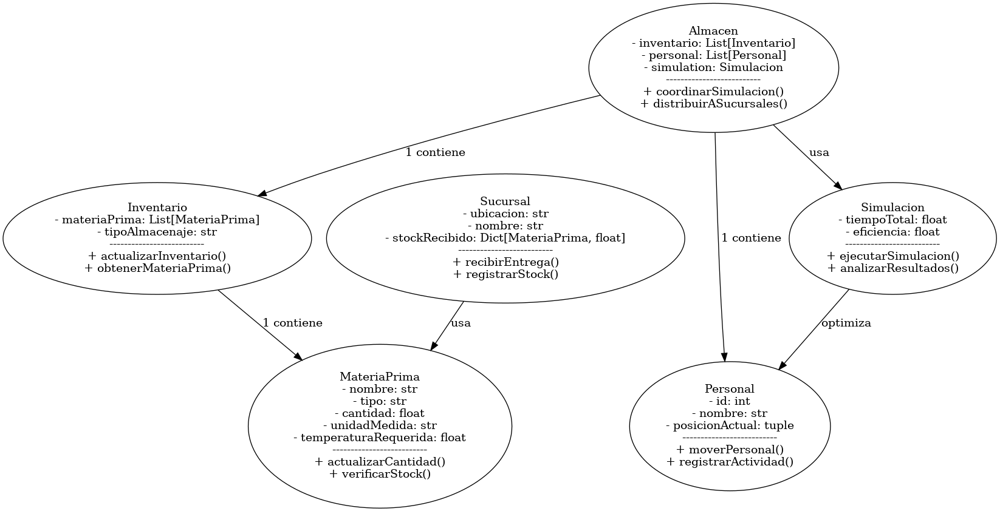

# Reto Multiagentes

## Conformación del Equipo

**Integrantes del equipo**  
- Esteban Leal Menéndez - Rol en el equipo  
  - **Fortalezas:** Descripción de fortalezas personales (ej. manejo de bases de datos, habilidades de programación, liderazgo, etc.).
  - **Áreas de oportunidad:** Descripción de áreas en las que el integrante desea mejorar.
  - **Expectativas del bloque:** ¿Qué espera aprender o lograr en este bloque?
 
- Daniel Arteaga Mercado - Líder  
  - **Fortalezas:** Soy una persona responsable y comprometida con los objetivos planteados, me desenvuelvo de manera adecuada al trabajar colaborativamente y siempre trato de aportar ideas innovadoras/creativas.
  - **Áreas de oportunidad:** A veces no comunico asertivamente mis ideas y me cuesta asignar tiempos específicos para la realización de tarea.
  - **Expectativas del bloque:** Espero poder trabajar de manera fluida y eficiente junto con el socio formador para poder lograr, como equipo, un producto final con calidad en el que apliquemos los conocimientos adquiridos en la materia y al mismo tiempo aporte valor a la empresa del socio.  
 
- Stephanie Ortega Espinosa- Rol en el equipo  
  - **Fortalezas:** Descripción de fortalezas personales (ej. manejo de bases de datos, habilidades de programación, liderazgo, etc.).
  - **Áreas de oportunidad:** Descripción de áreas en las que el integrante desea mejorar.
  - **Expectativas del bloque:** ¿Qué espera aprender o lograr en este bloque?
 
- Gabriel Ponce Peña - Rol en el equipo  
  - **Fortalezas:** Descripción de fortalezas personales (ej. manejo de bases de datos, habilidades de programación, liderazgo, etc.).
  - **Áreas de oportunidad:** Descripción de áreas en las que el integrante desea mejorar.
  - **Expectativas del bloque:** ¿Qué espera aprender o lograr en este bloque?
 
- Ángel Rogelio Cruz Ibarra - Rol en el equipo  
  - **Fortalezas:** Descripción de fortalezas personales (ej. manejo de bases de datos, habilidades de programación, liderazgo, etc.).
  - **Áreas de oportunidad:** Descripción de áreas en las que el integrante desea mejorar.
  - **Expectativas del bloque:** ¿Qué espera aprender o lograr en este bloque?

**Expectativas del equipo**  
- ¿Qué esperan lograr como equipo al finalizar el bloque?
- Listado de metas específicas del equipo para este proyecto.
- Compromisos individuales y colectivos para alcanzar los objetivos.

## Descripción del Reto a Desarrollar

El reto propuesto por el socio formador “Ponte Pizza” es rediseñar un espacio, el cual actualmente se utiliza como “bodega”, con el fin de que este sirva como espacio de almacenaje de materia prima para la preparación de las pizzas, en este se colocarán refrigeradores, estanterías y congeladores. Desde este espacio que se encuentra en la parte trasera del local central de “Ponte Pizza”, también se pretende distribuir a las demás sucursales de la ciudad, ya que actualmente el proveedor reparte sucursal por sucursal la materia prima, esto generará que se optimicen las rutas de entrega, se reduzca el tiempo de espera de las sucursales y se disminuyan los costos logísticos. Nosotros como ingenieros en sistemas computacionales modelaremos el espacio tridimensional y el movimiento del personal dentro de este espacio como agentes informáticos inteligentes para que se pueda simular diferentes escenarios de trabajo, optimizar la distribución de los productos, reducir el tiempo de preparación de pedidos y mejorar la eficiencia general del almacén.

## Diagrama de agentes involucrados

## Diagrama de Protocolos de Interacción

## Plan de Trabajo y Aprendizaje Adquirido

1. **Plan de Trabajo:**  
   - Etapa 1: Descripción de actividades a realizar en esta etapa.
   - Etapa 2: Descripción de actividades a realizar en esta etapa.
   - …

2. **Aprendizajes Adquiridos:**  
   - Al final de cada etapa, documentaremos lo aprendido, los desafíos enfrentados y cómo se superaron.
